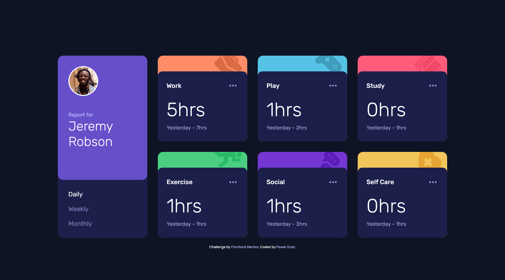

# Frontend Mentor - Time tracking dashboard solution

This is a solution to the [Time tracking dashboard challenge on Frontend Mentor](https://www.frontendmentor.io/challenges/time-tracking-dashboard-UIQ7167Jw). Frontend Mentor challenges help you improve your coding skills by building realistic projects.

## Table of contents

- [Overview](#overview)
  - [Screenshot](#screenshot)
  - [Links](#links)
- [My process](#my-process)
  - [Built with](#built-with)
  - [What I learned](#what-i-learned)
- [Author](#author)

## Overview

### Screenshot

### Links

- Live Site URL: [Frontend Mentor Time tracking dashboard](https://pawel-gnat.github.io/Frontend-Mentor-Time-tracking-dashboard/)

## My process

Java Script:

1. Created variables
2. Created async function to fetch json file
3. Set many loop functions (to start animation, insert data from json to html)
4. Created on page load function to display cards.

### Built with

- Semantic HTML5 markup
- CSS custom properties
- Flexbox
- Mobile-first workflow
- JavaScript

### What I learned

This challenge took me 13 hours, but almost 10 hours was searching the internet for informations how to fetch json file and work with it. I did many loops to start my bonus animations and dynamic insert data.

Below I copy links that I found helpful for me:

- https://rapidapi.com/guides/fetch-api-async-await
- https://dmitripavlutin.com/javascript-fetch-async-await/

Check out my extra ideas with animations.

## Author

- Frontend Mentor - [@Pawel-Gnat](https://www.frontendmentor.io/profile/Pawel-Gnat)
